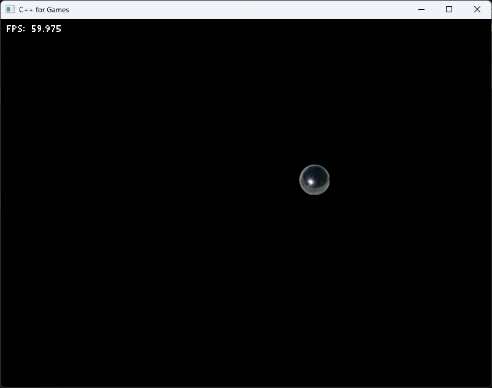

# C++ for Games

This is a template project for the **C++ for Games** course. It contains a simple 2D game framework.

## Features

* 2D software rasterizer in the [Image](graphics/inc/Graphics/Image.hpp) class.
* Support for gamepads (currently using [XInput](https://learn.microsoft.com/en-us/windows/win32/xinput/getting-started-with-xinput) on Windows)
* Spatialized [audio](audio) library with support for wav, mp3, ogg, flac audio file sources.
* Create your own waveforms for your game using the [Waveform](audio/include/Audio/Waveform.hpp) class.
* A few math helpers in the [math](math) library ([AABB](math/inc/Math/AABB.hpp), [Camera2D](math/inc/Math/Camera2D.hpp), [Transform2D](math/inc/Math/Transform2D.hpp), etc...)

## Quick Start

Make sure you have the latest version of Visual Studio 2022 installed. Make sure you have the "Desktop Development with C++" workload checked in the Visual Studio Installer.

To get started with your own project, click the big green "Use this template" button in GitHub to create a copy of this repo in your own GitHub workspace.

> **Optional**: The [game-vsix/bin](game-vsix/bin) folder contains a Visual Studio extension installer that adds a new C++ project template to the `Add New Project` dialog box in Visual Studio. This extension contains a project template for creating new games that use the **C++ for Games** game framework. Run the `.vsix` file in that folder to install the extension.

Open [CppForGames.sln](CppForGames.sln) in Visual Studio 2022 and run the `sample` project. You should see a bouncing ball on the screen. You should also hear a sound when the ball bounces off the edges of the screen:

You can use the `sample` project as a basis for your own games:

1. Copy the [sample](sample) folder and rename new folder to the name of your game.
2. Rename `sample.vcxproj`, `sample.vcxproj.filters`, and `sample.vcxproj.user` to the name of your game. For example, if the name of your game is MyGame, then rename these files to `MyGame.vcxproj`, `MyGame.vcxproj.filters`, and `MyGame.vcxproj.user` respectively.
3. Add the new project to the existing `CppForGames` solution in Visual Studio.
4. Rename the new project in Visual Studio to the name of your game.

> **Optional**: If you installed the Visual Studio extension in the [game-vsix/bin](game-vsix/bin) folder, then you can use the "Add new project" command to create a new game project that uses the C++ for Games framework.

